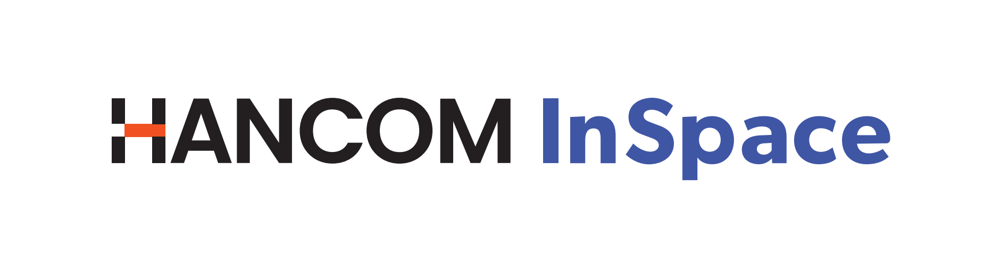
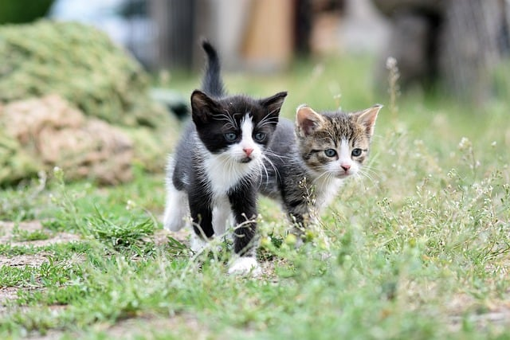
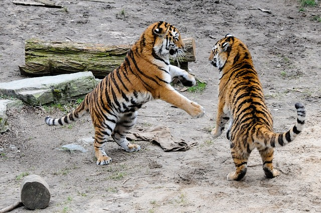
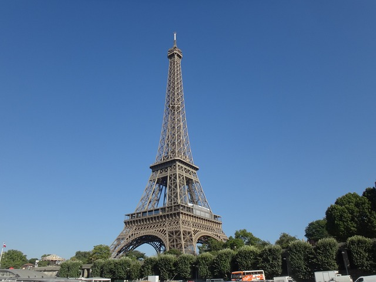
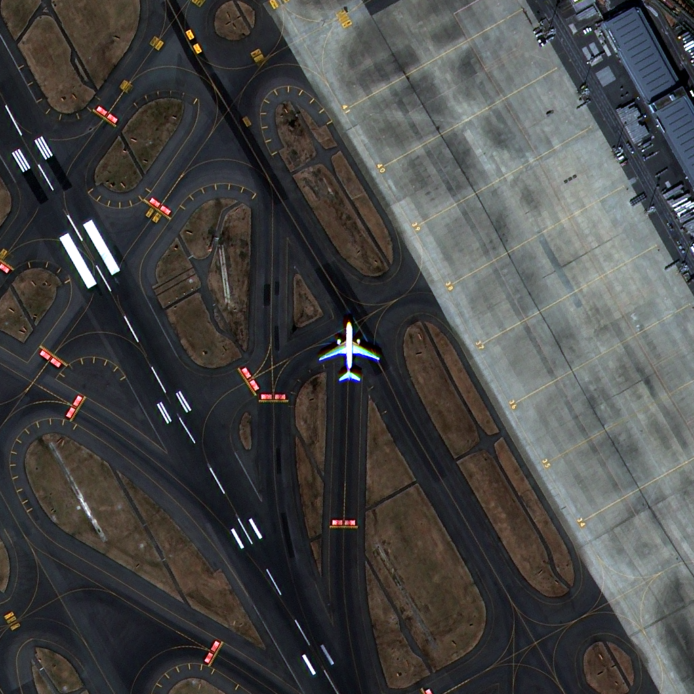

<div align="center">
  
<h1><span style="color:#475b9f;">H</span> <span style="color:#ff5733;">i</span> LLaVA-llama3.1
<p>
<p style="font-size: 0.7em;">: Hancom InSpace Large Language and Vision Assistant</p>
</h1>

</div>

<div align="center">

[](https://huggingface.co/HancomInSpaceAI/HiLLaVA-llama_3_1-8b)
[](https://github.com/InSpaceAI/HiLLaVA-llama3.1)

</div>

## Overview

Hello,

We are pleased to introduce our fine-tuned model, which is based on the LLaVA architecture and incorporates both the 'openai/clip-vit-large-patch14' and 'meta-llama/Meta-Llama-3.1-8B' models. This model, developed by Hancom Inspace, has been further refined to enhance its performance.

Additionally, we have enabled Korean language support by performing fine-tuning with the 'liuhaotian/LLaVA-Pretrain' and 'liuhaotian/LLaVA-Instruct-150K' models, which have been translated into Korean. This allows the model to provide responses in Korean effectively.

Thank you for your interest and support.

## dataset
> Translate to Korean

- [pretrain](https://huggingface.co/datasets/liuhaotian/LLaVA-Pretrain)
- [fine-tuning](https://huggingface.co/datasets/liuhaotian/LLaVA-Instruct-150K)

## Inference
```bash
# scripts/hillava_inference.sh

./scripts/hillava_inference.sh
```
## Example Output

|  |  |  |  |
|-------------------------------------|-------------------------------------|-------------------------------------|-------------------------------------|

```markdown
# Image1
Q: 해당 이미지를 설명해주세요.
HiLLaVA: 이 이미지에는 풀밭을 가로질러 걷고 있는 흑백 고양이 두 마리가 등장합니다. 한 마리는 왼쪽에, 다른 한 마리는 오른쪽에 있습니다. 두 고양이는 서로 가까이 붙어 있으며, 한 마리는 다른 고양이보다 약간 앞서 걷고 있는 것처럼 보입니다. 고양이 중 한 마리가 다른 고양이보다 약간 작아 보이는데, 이는 나이 차이를 나타내는 것일 수 있습니다. 고양이들은 풀밭을 가로질러 함께 이동하면서 장난스럽게 상호작용하는 것처럼 보입니다.

# Image2
Q: 어떤 동물이 보이나요?
HiLLaVA: 이미지 속 동물은 호랑이입니다.

# Image3
Q: 해당 건축물은 무엇인가요?
HiLLaVA: 해당 건축물은 파리, 프랑스에 위치한 유명한 랜드마크인 에펠탑입니다.

# Image4
Q: 대형 상업용 비행기가 있는 영역의 바운딩 박스 좌표를 알려주세요:
HiLLaVA:이 이미지는 공항 활주로에서 이륙을 준비하는 대형 상업용 비행기의 모습을 보여줍니다. 비행기는 활주로 중앙 근처에 위치하여 이륙을 준비하고 있습니다. 활주로 주변에는 여러 대의 차량이 흩어져 있으며, 일부는 비행기와 가깝게, 다른 차량은 멀리 떨어져 있습니다. 이 차량들은 비행기가 이륙할 준비를 하는 동안 비행기를 지원하는 지상 서비스 차량일 가능성이 높습니다. 이 장면은 비행기가 이륙을 준비하는 공항의 분주한 분위기를 포착합니다.
Q: [0.44, 0.47, 0.55, 0.56]

```

<div align="center">
  
</div>


## Citation
```bibtex
@misc{
      title={HiLLaVA-llama3.1: Hancom Inspace Large Language and Vision Assistant},
      author={JoChanho},
      url={https://github.com/InSpaceAI/HiLLaVA-llama3.1},
      year={2024}
}
```

## Acknowledgments
We would like to express our gratitude to the LLaVA team for their valuable contributions in providing the LLaVA code base and dataset as open-source resources. Their dedication to sharing knowledge and tools has significantly aided the development of this project.

If you encounter any issues or have questions, please feel free to create an issue. We also welcome pull requests for new features or improvements to the project. Your contributions are highly appreciated and help us make this project better for everyone.
> LLaVA 코드 베이스와 데이터 세트를 오픈 소스 리소스로 제공하는 데 귀중한 기여를 해주신 LLaVA 팀에 감사의 말씀을 전하고 싶습니다. 지식과 도구를 공유하려는 그들의 헌신은 이 프로젝트의 개발에 큰 도움이 되었습니다.
문제가 발생하거나 궁금한 점이 있으면 언제든지 문제를 만들어 주세요. 또한 프로젝트의 새로운 기능이나 개선 사항에 대한 풀 요청도 환영합니다. 귀하의 기여는 매우 높이 평가되며 모든 사람을 위해 이 프로젝트를 더 좋게 만드는 데 도움이 됩니다.